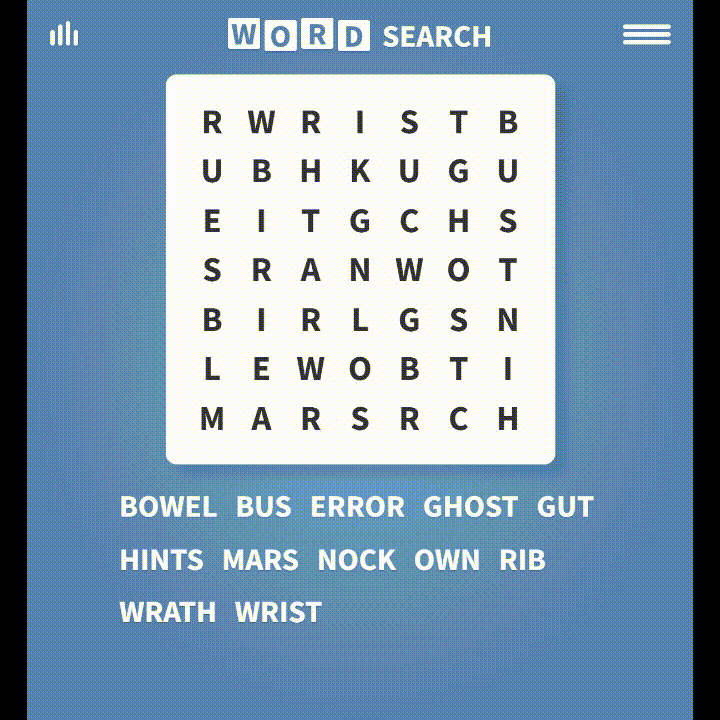

# WordSearch Resolver 🔠

## Descripción

**WordSearch Resolver** es una herramienta que automatiza la resolución de sopas de letras de la página [WordSearch](https://api.razzlepuzzles.com/wordsearch) a partir de imágenes. Simplemente sube una imagen del juego, y el sistema detectará y resaltará automáticamente todas las palabras a buscar. Utiliza técnicas de **Reconocimiento Óptico de Caracteres (OCR)** gracias a la libreria **easyocr** para identificar las letras y resolver el rompecabezas.

### ¿Cómo funciona?
1. Coloca tu imagen en la carpeta de `data`.
2. Cambia en `main.py` el nombre de `file` por el nombre del archivo de tu imagen.
3. Al ejecutarlo, podrás encontrar la solución en la carpeta `data` con el nombre de `solved.png`. El proceso de resolución se guardará en la carpeta `frames`, dentro de un directorio con el mismo nombre de la imagen que introduciste.



---

## Instalación

Para usar **WordSearch Resolver**, sigue estos pasos:

1. Clona el repositorio:
   ```bash
   git clone https://github.com/A-Lob/wordsearch-resolver.git
2. Navega al directorio del proyecto:
   ```bash
   cd wordsearch-resolver
3. Instala las dependencias:
   ```bash
   pip install -r requirements.txt
3. Ejecuta la aplicación:
   ```bash
   python main.py

---


## Tecnologías utilizadas

- **easyocr**: Para detectar las letras en la imagen.
- **OpenCV**: Para el procesamiento de imágenes.
- **Python**: Lenguaje principal del proyecto.

---

## Contacto

Si tienes preguntas, sugerencias o simplemente quieres saludar, no dudes en contactarme:

- **Email**: [alex.lobaiza3@gmail.com](mailto:alex.lobaiza3@gmail.com)
